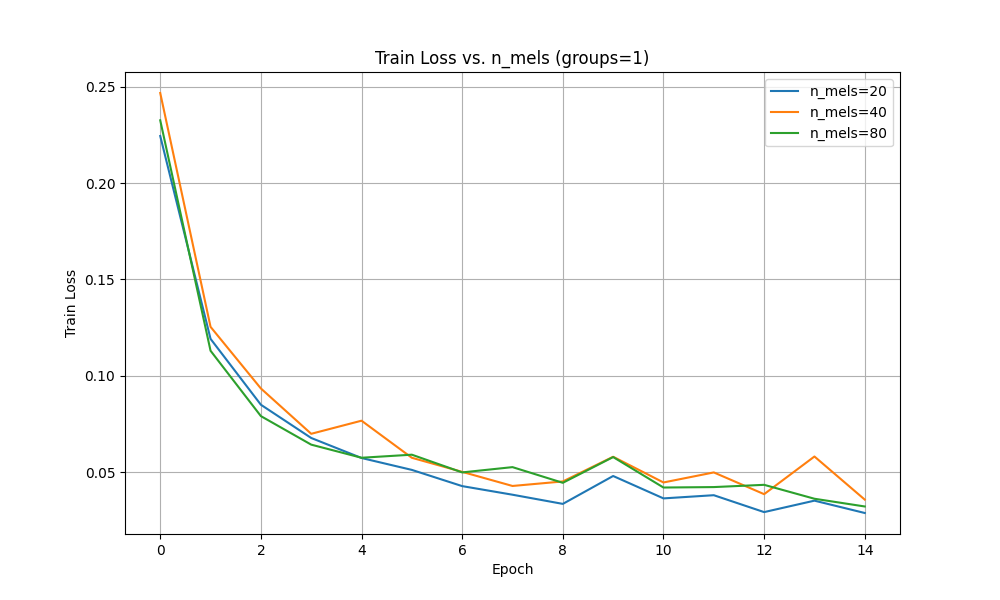
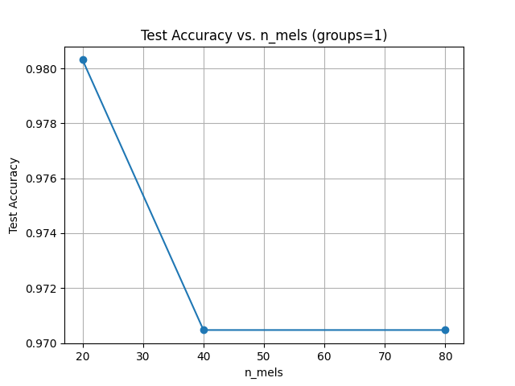
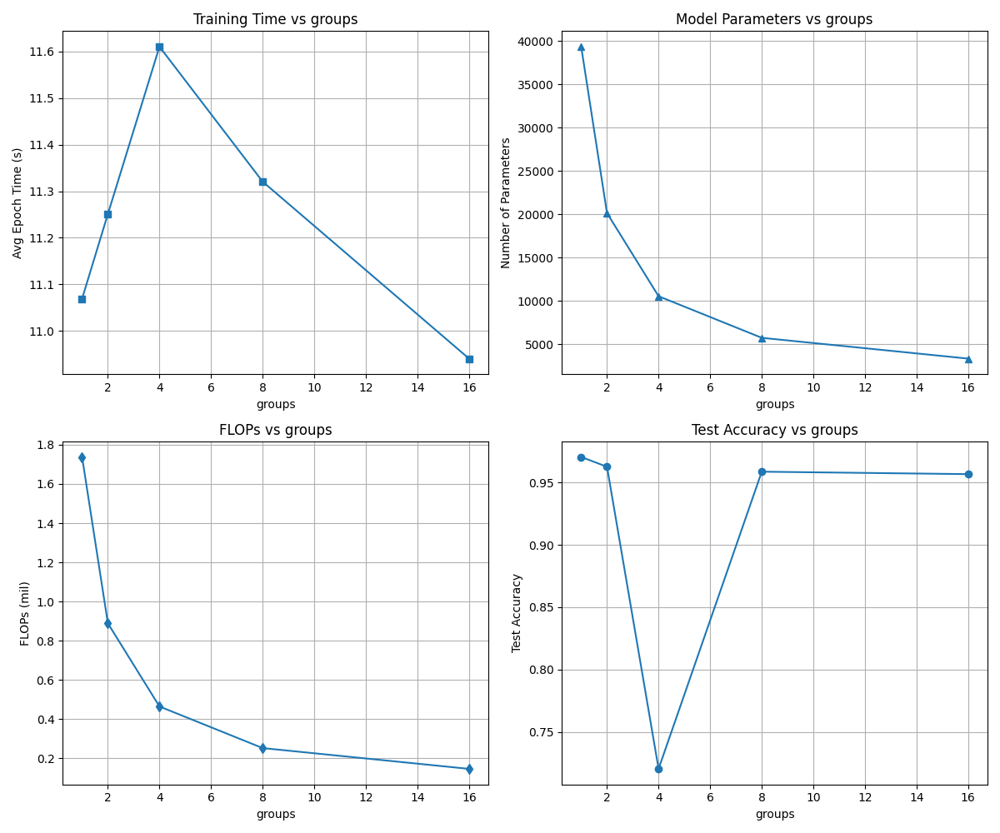

## Задача 1: Влияние количества мел-фильтров (`n_mels`)

Обучение модели с `n_mels ∈ {20, 40, 80}`, сохраняя количество сверточных групп равным 1 (стандартная свертка). Кривые потерь при обучении и точность на тестировании показаны ниже.

**Наблюдения:**
- Увеличение количества `n_mels` увеличило количество параметров, точность на тесте оказалась примерно одинаковой. Во время одного из прогонов точность была чуть лучше при большем `n_mels`.

- Модель с `n_mels = 20` достигла наилучшей точности на валидации и тесте. В другом прогоне, модель с `n_mels = 40` показала лучшую точность на валидации, но на тесте была ниже, чем у модели с `n_mels = 80`.

- Теоретически, точность должна улучшаться с повышением `n_mels`, но до определенного момента, после которого она может выйти на плато или ухудшиться из-за переобучения. Модели обучались по 15 эпох, все модели достигли плато на схожих эпохах, но конфигурация с `n_mels = 20` лучше всего показала себя на тесте. В других прогонах модель с `n_mels = 80` выходила вперед.

*Рисунок 1: Training loss по эпохам для разных значений n_mels (при groups = 1).*

*Рисунок 2: Accuracy в зависимости от n_mels (groups = 1).*

|n_mels|groups|best_epoch|best_val_acc|test_acc|parameters|flops    |
|------|------|----------|------------|--------|----------|---------|
|20    |1     |13        |0.9868      |0.9803  |33570     |1155968.0|
|40    |1     |10        |0.9831      |0.9705  |35490     |1349888.0|
|80    |1     |9         |0.9812      |0.9705  |39330     |1737728.0|

*Таблица 1: Результаты экспериментов с `n_mels`*

## Задача 2: Влияние группированных сверток (`groups`)

Используя значение `n_mels = 80` из Задачи 1, изменял параметр `groups` во всех слоях `Conv1d`. 
Групповые свертки уменьшают количество параметров и операций с плавающей запятой, поскольку каждый фильтр работает только с подмножеством входных каналов. Компромисс заключается в потенциальной потере межканальных взаимодействий.

**Наблюдения:**
- Как и ожидалось, увеличение количества групп уменьшает размер модели и вычислительные затраты.

- Для `groups = 2, 4, 8` точность на тестовом наборе оставалась близкой к бейзлайну (`groups = 1`), для `groups = 16` были получены хорошие метрики точности на тесте (0.9567) при использовании всего 3330 параметров (~8% от бейзлайна). 

- При `groups = 4` точность снизилась (0.7205), судя по логам обучения, скорее всего, модель переобучилась. Во время тестирования был случай, когда при `groups = 16` точность тоже снизилась (0,8031) либо также произошло переобучение, либо группы каналов стали слишком малы для осмысленных представлений.

- Время обучения за эпоху немного увеличилось относительно бейзлайна (с ~11,05 для `groups=1` до ~11,60 для `groups=4` на GPU). Разница незначительна, во время проведения экспериментов время изменялось нелинейно в зависимости от количества групп, но тенденция, в среднем, увеличения среднего времени обучения с увеличением количества группировок.

*Рисунок 3: Влияние `groups` на время обучения (вверху слева), количество параметров (вверху справа), количество операций с плавающей запятой (внизу слева) и accuracy на тесте (внизу справа).*

|n_mels|groups|best_epoch|best_val_acc|test_acc|parameters|flops    |
|------|------|----------|------------|--------|----------|---------|
|80    |2     |12        |0.9718      |0.9626  |20130     |889088.0 |
|80    |4     |13        |0.9680      |0.7205  |10530     |464768.0 |
|80    |8     |15        |0.9680      |0.9587  |5730      |252608.0 |
|80    |16    |14        |0.9718      |0.9567  |3330      |146528.0 |

*Таблица 2: Результаты экспериментов с `groups`*

---

## Сводная таблица экспериментов

|n_mels|groups|best_epoch|best_val_acc|test_acc|parameters|flops    |
|------|------|----------|------------|--------|----------|---------|
|20    |1     |13        |0.9868      |0.9803  |33570     |1155968.0|
|40    |1     |10        |0.9831      |0.9705  |35490     |1349888.0|
|80    |1     |9         |0.9812      |0.9705  |39330     |1737728.0|
|80    |2     |12        |0.9718      |0.9626  |20130     |889088.0 |
|80    |4     |13        |0.9680      |0.7205  |10530     |464768.0 |
|80    |8     |15        |0.9680      |0.9587  |5730      |252608.0 |
|80    |16    |14        |0.9718      |0.9567  |3330      |146528.0 |

Best overhaul:
|n_mels|groups|best_epoch|best_val_acc|test_acc|parameters|flops    |
|------|------|----------|------------|--------|----------|---------|
|80    |16    |14        |0.9718      |0.9567  |3330      |146528.0 |