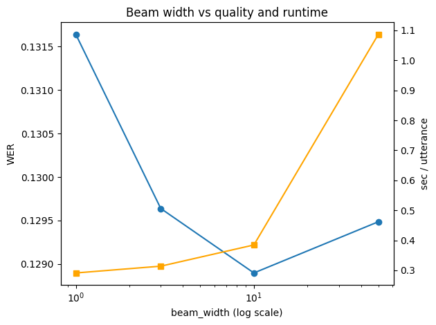
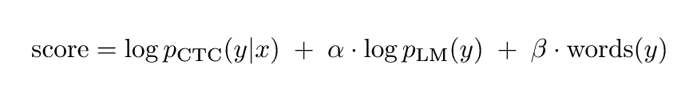
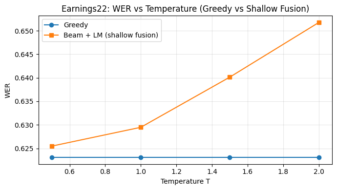
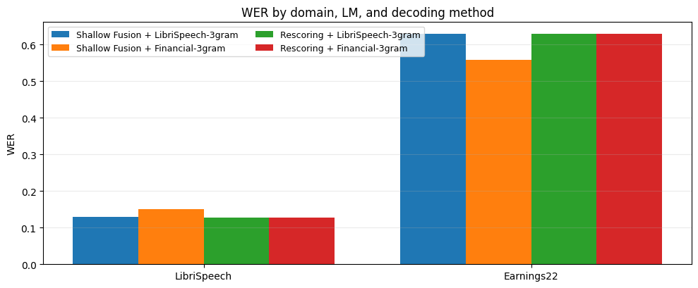

### Part 1 / Task 1 - Implement **Greedy CTC decoding** (`greedy_decode`)

Greedy CTC:

1.  Вычисление frame-level логарифмических вероятностей: `log_probs = log_softmax(logits)`.
2.  Выбор наилучшего токена для каждого фрейма: `argmax_t log_probs[t]`.
3.  CTC collapse rule: слияние повторяющихся символов и удаление blank-токена

### Part 1 / Task 2 - Implement **CTC beam search decoding (no LM)** (`beam_search_decode`)

Beam search для CTC имеет важную особенность: множество различных покадровых путей коллапсируют в один и тот же транскрипт (из-за blank-символов и повторений). Поэтому эффективный декодер должен отслеживать гипотезы-префиксы и суммировать вероятностную массу всех путей, ведущих к каждому префиксу. Это реализовано в **CTC prefix beam search**, где для каждого префикса поддерживаются две оценки: вероятность окончания префикса на blank и на non-blank токене .

#### Сравнение beam width на датасете librispeech_test_other

|   beam_width|  n |   wer   |   cer   | sec_per_utt |
|-------------|----|---------|---------|-------------|
|           1 | 200| 0.131642| 0.047008|    0.291235 |
|           3 | 200| 0.129638| 0.046618|    0.313818 |
|          10 | 200| 0.128897| 0.046305|    0.384540 |
|          50 | 200| 0.129486| 0.046449|    1.086799 |

*График:* 



- `beam_width=1` часто дает результаты, близкие к жадному алгоритму, но не идентичные ему, так как prefix beam search суммирует вероятностную массу путей иначе, чем pure best-path argmax.
- Увеличение beam width снижает WER/CER до насыщения; время выполнения растет примерно линейно для данного небольшого словаря: O(T * beam_width * V).

### Part 1 / Task 3 - **Temperature scaling sweep (greedy only)**

Скейлинг температуры применяем так:
```python
logits = logits / self.temperature
```
Затем в декодере вычисляем:
```python
log_probs = torch.log_softmax(logits, dim=-1)
```

Деление логитов на температуру **T** изменяет форму распределения softmax:
- **T < 1** → более 'острое' распределение (высокая уверенность).
- **T > 1** → более 'плоское' распределение (низкая уверенность).

#### Temperature scaling sweep table

|   T |  n |    WER     |       CER|    sec_per_utt|
|-----|----|------------|----------|---------------|
|  0.5| 200|    0.131532|  0.047071|    0.275517   |
|  0.8| 200|    0.131532|  0.047071|    0.271984   |
|  1.0| 200|    0.131532|  0.047071|    0.259294   |
|  1.2| 200|    0.131532|  0.047071|    0.254060   |
|  1.5| 200|    0.131532|  0.047071|    0.271980   |
|  2.0| 200|    0.131532|  0.047071|    0.274723   |

**По результатам:** Greedy decoding не зависит от температуры. Использует `argmax` на каждом кадре, деление на положительную константу не меняет порядок значений. Следовательно, транскрипт остается неизменным, и метрики WER/CER идентичны для всех значений T.

### Part 2 / Task 4 - Implement **beam search with LM (shallow fusion)**

Shallow fusion объединяет акустическую и языковую модели во время поиска:
<!-- ```LaTeX
\[
\text{score} = \log p_{\text{CTC}}(y|x) \;+\; \alpha \cdot \log p_{\text{LM}}(y)\;+\;\beta \cdot \#\text{words}(y)
\]
``` -->


- `alpha` - вес языковой модели.
- `beta` - бонус за вставку слова (word insertion bonus), предотвращает слишком короткие гипотезы.

Так как используется word-level KenLM, декодер отслеживает текущее частичное слово и обращается к LM только при завершении слова.

#### Влияние гиперпараметров
- Маленький `alpha` → поведение, близкое к обычному beam search.
- Большой `alpha` → LM доминирует, WER ухудшается.
- `beta` помогает избежать слишком коротких гипотез, но избыточное значение может вызвать лишние вставки слов.

#### Результаты поиска гиперпараметров (shallow fusion)

WER

| alpha \ beta| 0.0        | 0.5        | 1.0        | 1.5        |
|-------------|------------|------------|------------|------------|
| 0.01        | 0.129486   | 0.129026   | 0.132497   | 0.133537   |
| 0.05        | 0.129713   | 0.128917   | 0.132497   | 0.133537   |
| 0.10        | 0.129549   | 0.128917   | 0.132529   | 0.133537   |
| 0.50        | 0.130852   | 0.128949   | 0.131450   | 0.132798   |
| 1.00        | 0.133551   | 0.130332   |**0.128637**| 0.131405   |
| 2.00        | 0.136572   | 0.135814   | 0.131408   | 0.129505   |
| 5.00        | 0.287104   | 0.234156   | 0.217883   | 0.199256   |

**Лучший результат:** `alpha=1.0`, `beta=1.0`, WER=0.128637, CER=0.046179.

### Part 2 / Task 5 -  Plug in the **OpenSLR 4‑gram KenLM** and evaluate vs 3‑gram

| LM | alpha | beta | beam_width | WER | CER |
|----|-------|------|------------|-----|-----|
| 3‑gram pruned | 1.0 | 1.0 | 50 | 0.128637 | 0.046179 |
| 4‑gram | 1.0 | 1.0 | 50 | 0.129587 | 0.046349 |

4-грамм модель дает минимальное улучшение, так как акустическая модель уже хорошо обучена на ин-доменных данных. Преимущества более крупной LM проявляются на длинных и неоднозначных контекстах, которые shallow fusion может использовать не в полной мере.

### Part 2 / Task 6 - Implement **second-pass LM rescoring** (`lm_rescore`) + sweeps + qualitative analysis

Рескоринг выполняется в два этапа:
1. Генерация N-best списка с помощью CTC beam search без LM.
2. Переранжирование кандидатов с использованием KenLM и word bonus.

#### Преимущества рескоринга перед shallow fusion
- **Shallow fusion** использует LM во время поиска. При большом `alpha` LM может преждевременно отсеять акустически верные пути (search error).
- **Second-pass rescoring** сохраняет акустически правдоподобные гипотезы в N-best списке. LM влияет только на ранжирование, что позволяет избежать потери правильных гипотез.

#### Результаты поиска гиперпараметров (rescoring)

WER

| alpha\ beta | 0.0        | 0.5        | 1.0        | 1.5        |
|-------------|------------|------------|------------|------------|
| 0.01        | 0.129486   |**0.128132**| 0.132017   | 0.133701   |
| 0.05        | 0.129486   | 0.128132   | 0.132017   | 0.133701   |
| 0.10        | 0.129322   | 0.128132   | 0.131678   | 0.133545   |
| 0.50        | 0.130768   | 0.128949   | 0.131643   | 0.132072   |
| 1.00        | 0.133031   | 0.130104   | 0.128324   | 0.130974   |
| 2.00        | 0.135869   | 0.133325   | 0.130768   | 0.128949   |
| 5.00        | 0.155105   | 0.149570   | 0.145345   | 0.142687   |

**Лучший результат:** `alpha=0.01`, `beta=0.5`, WER=0.128132, CER=0.046078.

#### Качественное сравнение
##### Примеры

**Пример 1 (WAV: sample_153.wav)**
```
REF: each that died we washed and shrouded in some of the clothes and linen cast ashore by the tides and after a little the rest of my fellows perished one by one till i had buried the last of the party and abode alone on the island with but a little provision left i who was wont to have so much
BEAM: each that died we washed and shrowded in some of the clothes and linen cast a shore by the tides and after little the rest of my fellows perished one by one till i had buried the last of the party and aboade alone on the island with but a little provision left i who was wont to have so much (WER=8.20%)
SF: each that died we washed and shrowded in some of the clothes and linen cast a shore by the tides and after a little the rest of my fellows perished one by one till i had buried the last of the party and aboade alone on the island with but a little provision left i who was wont to have so much (WER=6.56%)
RS: each that died we washed and shrowded in some of the clothes and linen cast a shore by the tides and after a little the rest of my fellows perished one by one till i had buried the last of the party and aboade alone on the island with but a little provision left i who was wont to have so much (WER=6.56%)
```

**Пример 2 (WAV: sample_33.wav)**
```
REF: and why did andy call mister gurr father
BEAM: and why did andy call mister gurfather (WER=25.00%)
SF: and why did andy call mister gur father (WER=12.50%)
RS: and why did andy call mister gur father (WER=12.50%)
```

**Пример 3 (WAV: sample_127.wav)**
```
REF:  gurr saluted and stated his business while the baronet who had turned sallower and more careworn than his lot drew a breath full of relief one of your ship boys he said
BEAM: girl saluted and stated his business while the baronett who had turned salerand more carwine an his lot drew a breath of full of relief one of your ship boys she said   (WER=25.00%)
SF:   girl saluted and stated his business while the baronett who had turned sale rand more carwine an his lot drew a breath of full of relief one of your ship boys she said   (WER=25.00%)
RS:   girl saluted and stated his business while the baronett who had turned sale rand more carwine an his lot drew a breath of full of relief one of your ship boys she said   (WER=25.00%)
```

**Пример 4 (WAV: sample_81.wav)**
```
REF:  awkward bit o country sir six miles row before you can find a place to land
BEAM: alkward but a country sir six miles oro before you cand find a place to land   (WER=31.25%)
SF:   alkward but a country sir six miles or o before you cand find a place to land   (WER=37.50%)
RS:   alkward but a country sir six miles oro before you cand find a place to land   (WER=31.25%)
```

**Пример 5 (WAV: sample_103.wav)**
```
REF:  he swung round walked aft and began sweeping the shore again with his glass while the master and dick exchanged glances which meant a great deal
BEAM: he swung round walked aff and began sweeping the shore again with his glass while the master and dick exchanged glances which met agreed deal   (WER=15.38%)
SF:   he swung round walked aff and began sweeping the shore again with his glass while the master and dick exchanged glances which met agreed deal   (WER=15.38%)
RS:   he swung round walked aff and began sweeping the shore again with his glass while the master and dick exchanged glances which met a greed deal   (WER=11.54%)
```

**Пример 6 (WAV: sample_24.wav)**
```
REF:  a fellow who was shut up in prison for life might do it he said but not in a case like this
BEAM: a fellow who as shut up in prison for life might doit he said but not in a case like this   (WER=13.64%)
SF:   a fellow who as shut up in prison for life might do it he said but not in a case like this   (WER=4.55%)
RS:   a fellow who as shut up in prison for life might do it he said but not in a case like this   (WER=4.55%)
```

**Пример 7 (WAV: sample_79.wav)**
```
REF:  that's right of course well armed
BEAM: that's right of course willamed   (WER=33.33%)
SF:   that's right of course will amed   (WER=33.33%)
RS:   that's right of course will amed   (WER=33.33%)
```

##### Наблюдения

Ошибки, исправляемые LM
1. Разделение слитных слов:  
   В примере `sample_33.wav` beam search выдает `gurfather`, а shallow fusion и rescoring корректируют до `gur father`. LM правильно учитывает вероятность раздельного написания имени и титула.
2. Восстановление пропущенных коротких слов:  
   В `sample_153.wav` beam search пропускает артикль `a` во фразе `after a little`. Shallow fusion добавляет его, снижая WER с 8.20% до 6.56%. LM компенсирует акустическую неопределенность коротких слов.
3. Коррекция числа / окончаний:  
   В `sample_24.wav` beam search выдает `doit`, shallow fusion и rescoring исправляют на `do it`. LM предпочитает раздельную форму глагола и местоимения.

Ошибки, которые LM не исправляет или усугубляет
1. Акустически похожие, но семантически неверные слова  
   В `sample_127.wav` во всех вариантах остается `girl saluted` вместо `gurr saluted`. LM не имеет информации о том, что `gurr` - это имя собственное, и не может отличить его от слова `girl` по акустическим признакам. Аналогично в `sample_81.wav`: `alkward` вместо `awkward`, `oro` вместо `row`.
2. Ошибки из-за домена обучения
   В `sample_79.wav` `willamed` не исправляется ни в одном из методов. Слово `well armed` - редкое в общем корпусе, LM 3‑грамма не дает достаточного веса для корректировки.
3. Фонетические замены  
   В `sample_103.wav` beam search и shallow fusion ошибаются в `which met agreed deal`, тогда как rescoring выдает `which met a greed deal`. LM не смогла исправить исходную ошибку, но предложила альтернативу, которая улучшила WER (11.54% против 15.38% у beam search).

На большинстве примеров результаты shallow fusion и rescoring совпадают, но например в `sample_103.wav` наблюдается различие:
- **Beam search**: `which met agreed deal` (WER 15.38%)
- **Shallow fusion**: `which met agreed deal` (WER 15.38%)
- **Rescoring**: `which met a greed deal` (WER 11.54%)

Здесь shallow fusion не смог изменить первоначальный выбор из-за того, что LM применялась слишком рано и не позволила попасть в beam альтернативным гипотезам с правильным членением `a greed`. Рескоринг, напротив, получил в N-best список вариант `which met a greed deal` и смог его выбрать, так как LM применялась только на этапе ранжирования.

**Выводы:**  
- **Shallow fusion** чувствительна к поисковым ошибкам: при высоком весе LM правильные гипотезы могут быть отсеяны ещё до завершения поиска.  
- **Rescoring** позволяет избежать этого, сохраняя акустически правдоподобные варианты, но ограничена качеством N-best списка. В данном примере rescoring улучшил результат, где shallow fusion не справилась, что демонстрирует преимущество двухэтапного подхода.

### Part 2 / Task 7a - Evaluate best SF + best RS on **Earnings22**

| Method | LibriSpeech WER | LibriSpeech CER | Earnings22 WER | Earnings22 CER |
|---|---|---|---|---|
| Greedy | 0.1315 | 0.0471 | 0.6231 | 0.3128 |
| Beam search | 0.1295 | 0.0464 | 0.6236 | 0.3120 |
| Beam + 3-gram (shallow fusion) | 0.1286 | 0.0462 | 0.6295 | 0.3114 |
| Beam + 3-gram (rescoring) | 0.1281 | 0.0461 | 0.6298 | 0.3118 |

#### Наблюдения
- На Earnings22 наблюдается резкое ухудшение всех метрик по сравнению с LibriSpeech, что ожидаемо из-за смены домена (финансовая тематика, акценты).
- Разница между методами на Earnings22 минимальна, что указывает на ограниченную эффективность shallow fusion и рескоринга в out-of-domain условиях.

### Part 2 / Task 7b - Temperature sweep on Earnings22

| T | greedy_WER | greedy_CER | sf_WER | sf_CER |
|-----|--------|---------|----------|----------|
| 0.5 | 0.6231 | 0.31281 | 0.625479 | 0.312458 |
| 1.0 | 0.6231 | 0.31281 | 0.629477 | 0.311382 |
| 1.5 | 0.6231 | 0.31281 | 0.640137 | 0.315141 |
| 2.0 | 0.6231 | 0.31281 | 0.651745 | 0.316484 |

*График:* 



#### Анализ
1. **Greedy decoding** - WER и CER остаются неизменными, что подтверждает теоретическую инвариантность greedy-декодера к температуре.
2. **Shallow fusion**:
   - При T < 1 (острое распределение) WER на Earnings22 снижается по сравнению с T=1.
   - При T > 1 WER растет.
   - Акустическая модель на out-of-domain данных (Earnings22) может быть перекалибрована: высокие температуры сглаживают чрезмерно уверенные, но неверные предсказания, позволяя LM оказывать большее влияние. В данном случае оптимальным оказалось 'заострение' распределения (T < 1).

### Part 2 / Task 9 - 3gram and financial fine-tune model comparsion

|LM	|Method|alpha|beta|LibriSpeech_WER|LibriSpeech_CER|Earnings22_WER|Earnings22_CER
|-----|--------|---------|----------|----------|----------|----------|----------|
|	LibriSpeech-3gram   |Shallow Fusion|1.00|1.0|0.128637|0.046180|	0.629477|0.311382|
|	LibriSpeech-3gram   |Rescoring	   |0.01|0.5|0.128132|0.046078|	0.629808|0.311804|
|	Financial-3gram     |Shallow Fusion|1.00|1.0|0.150389|0.050800|	0.557587|0.311531|
|	Financial-3gram     |Rescoring	   |0.01|0.5|0.127716|0.046050|	0.628423|0.311872|

*График WER:* 



- **In-domain (LibriSpeech):** если `3-gram` взять за бейзлайн решение, то благодаря расширению формулировок при рескоринге удалость получить лучшие метрики на `financial 3-gram`.
- **Out-of-domain (Earnings22):** `financial 3-gram` (метод Shallow Fusion) будет лучше, поскольку модель специально обучена на формулировках конференц-звонков и финансовой лексике.
